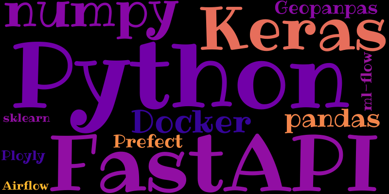

# Hi 👋, I am Yuka Kudo 🦘🐨

## 🍓 About Me

- 💻 Self-taught Developer : +3 Years Experience
- ✨ What I will shine : LLMs, NLP, AI, RAG
- 🏫 Background : Marketing, Study Consulting
- 🏫 Indutosry : e-commerce, Education, Logistics/transportation, Biology
- 🔭 Currently working on **AI Recipe Generator**
- 🌱 Currently learning **Kubernetes**
- 🌱 Currently my level at [Codewars](https://www.codewars.com/users/yukaberry)

- ⚡ Fun fact:  I am a travel hack pro — I can usually find cheaper train tickets in Germany than you would expect.

 I am a self-taught developer driven by a passion for learning through building. My journey has been shaped by hands-on projects, online courses, books, and countless hours exploring documentation and tutorials. I believe in learning through doing—whether it is tackling coding challenges, following in-depth tutorials, or diving into technical literature.

While working at a startup with limited resources and no dedicated data team, I was faced with a real-world data analytics challenge. I took the initiative to learn and apply data skills directly in a work setting, which not only helped solve immediate problems but also sparked a deeper interest in Python and data science as a whole. Since then, I have continued to develop my skills through practical projects, moving beyond basic analytics to explore the broader landscape of data-driven development.

## 🛠️ Languages and Tools

  

  
  
  

  
  

  
  
  
  
  
  
  
  
  
  

  
  

## ⚙️ Stats

# 

## 🚀 Projects

### [Detect AI Contents](https://github.com/yukaberry/detect_ai_content)
> Detects AI-generated images and text through analysis.
> 2024
- Tech used: Tech used: HuggingFace,transformers,tensorflow,docker, fastapi, prefect
- GitHub: [Project Link](https://github.com/yukaberry/detect_ai_content)
- Demo: [Youtube Link](https://www.youtube.com/watch?v=9o40xnghODU)

### [AI recipe generator](https://github.com/yukaberry/)
> AI adjusts the original recipe to fit diets like vegan, gluten-free, or sugar-free — not just by removing ingredients, but **by adding tasty alternatives**.
> 2025
- Tech used: HuggingFace,transformers,tensorflow,docker, fastapi, prefect
- GitHub: [Project Link](https://github.com/yukaberry/)
- Demo: [App](https://)

## 📘🏫 Courses I have completed

- **Bootcamp : Data Science and AI** : Le Wagon – *2024*
- **Online course : Inferential statistics** : Udacity – *2021*
- **Online course : Machine Learning II** : Frauenloop – *2021*
- **Study Group : Machine Learning I** : Frauenloop – *2020*
- **Online course : Analyzing Data with Python** : IBM – *2020*
- **Online course :Data Science with Python for beginner** : Udemy, SIGNATE – *2020*
- **Online course : Python** : Progate – *2019*

## 📚 Books I have larned from

- Introduction to Machine Learning with Python : O'REIlLY
- Pythonで学ぶあたらしい統計学の教科書 (Learn Statistics with Python)
- Pythonによるスクレイピング&機械学習 開発テクニック　(Scraping and ML with Python)
- キタミ式イラストIT塾 基本情報技術者　(CS Basic)
- 東京大学のデータサイエンティスト育成講座 ~Pythonで手を動かして学ぶデ―タ分析 (Data Science from Tokyo Univercity)

## 📌 Online resrouces (Python)

- https://www.geeksforgeeks.org/
- https://realpython.com/

## ⏩ YouTube Channels (Statistics and Maths)

- https://www.youtube.com/@MathAndScience
- https://www.youtube.com/@statquest
- https://www.youtube.com/@aiby8596
- https://www.youtube.com/@yobinori

## 🫶 Mentors and Communities I got support from

- https://codebar.io
- Meetup groups for Python and Data Science
- https://www.mentoring-club.com/
- https://www.frauenloop.org/
